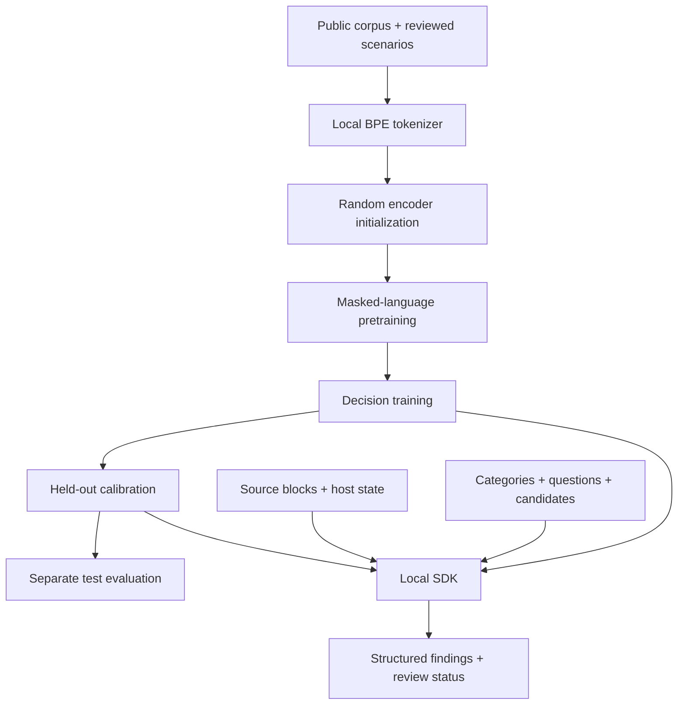

<p align="center">
  
</p>
<h1 align="center">Starlings</h1>
<p align="center"><strong>Small models. Explicit context. Structured decisions.</strong></p>
<p align="center">
  Train a local, non-generative decision model from scratch.<br />
  Give it content, state, categories, and questions. Get evidence-linked findings.
</p>
<p align="center">
  <a href="https://github.com/beaglabs/starling/actions/workflows/ci.yml"></a>
  
  
  <a href="LICENSE"></a>
</p>
<p align="center">
  <a href="#quickstart">Quickstart</a> ·
  <a href="#python-sdk">SDK</a> ·
  <a href="#train-your-model">Training</a> ·
  <a href="#llm--pdf-handoff">LLM + PDF</a> ·
  <a href="#documentation">Docs</a>
</p>

---

## What Starlings does

Starlings is a training pipeline and Python SDK for fast decision support. A bidirectional encoder scores explicit alternatives rather than generating an answer. You control the evidence, context, category scope, and task definitions.

The first application is **CUI review**. The repository includes a pinned snapshot of **all 126 categories** listed in the NARA CUI Registry when retrieved on **October 2, 2026**, including definitions, authority citations, source URLs, Basic/Specified source-table values, and source hashes. These are training inputs and policy metadata; they do not supply labeled examples or prove that a model understands the rules.

> **Current status:** the training pipeline works; no validated CUI classifier or pretrained weights are shipped. The tiny demo checks the software using fictional support tickets. Its accuracy says nothing about CUI detection. Category findings are review and marking proposals, not designation or release authorization.

| Capability | Implementation |
| :--- | :--- |
| From-scratch training | Local byte-level BPE → random encoder weights → masked-language pretraining → decision training |
| Category coverage | Every category in the bundled NARA snapshot; evaluation can use `"all"` or explicit IDs |
| Context | JSON `state` and task-specific `questions` are encoded alongside source content |
| Structured decisions | Category outcomes: `applicable`, `not_applicable`, `insufficient_evidence` |
| LLM handoff | Validates candidate references/quotes and independently scans the supplied document |
| Confidence | Held-out temperature calibration; unmatched tasks remain uncalibrated |
| Review workflow | Missing calibration, low confidence, unresolved context, and experimental labels are explicit |
| Local execution | CPU, Apple MPS, or CUDA; training and inference make no network calls |

## Quickstart

Clone the repository and install Python **3.11 or later**. On an Apple Silicon Mac:

```bash
git clone https://github.com/beaglabs/starling.git
cd starling
python3 -m venv .venv
source .venv/bin/activate
python -m pip install -e '.[dev,pdf,registry]'
starlings doctor
```

For a CPU-only Linux installation, install CPU PyTorch before the editable package:

```bash
python -m pip install torch --index-url https://download.pytorch.org/whl/cpu
python -m pip install -e '.[dev,pdf,registry]'
```

Then run the complete, deliberately tiny demo:

```bash
bash scripts/smoke.sh
```

It creates a local tokenizer, random model, pretrained checkpoint, decision checkpoint, calibration artifact, test report, and SDK result under `runs/smoke/`. It uses **unreviewed fictional routing labels** and marks the resulting model as experimental. The final all-category prediction exercises the CUI interface; it is not a trained CUI detector.

Outputs are immutable by default. Use a fresh output directory for a second run:

```bash
bash scripts/smoke.sh runs/another-smoke
```

## Python SDK

After training your decision model:

```python
from starlings import Classifier

model = Classifier("runs/decision", device="auto")
result = model.evaluate(
    content="Fictional example: we need 15 airplane wings.",
    state={
        "provenance": {
            "source_type": "fictional_example",
            "public_release": "unknown",
            "contract": "unknown",
        },
        "review_goal": "Identify possible CUI and missing context.",
    },
    categories="all",
    questions={
        "source_established": {
            "instruction": "Does the evidence establish the source and release status?",
            "criteria": {
                "yes": "Reliable source and release context is established.",
                "no": "The claimed source or release status is contradicted.",
                "insufficient_evidence": "Source or release context is missing.",
            },
        }
    },
)

print(result.requires_review)
print(result.model_dump_json(indent=2))
technical_findings = result.filter_categories(["controlled_technical_information"])
```

`state` holds caller-supplied context. `questions` define decisions and described alternatives. Either or both can express nuance, but the model must be trained and evaluated on comparable tasks. A new question does not become reliable just because it fits the API.

Use `categories=[...]` to narrow computation. Use `result.filter_categories([...])` to filter already-computed findings. Every result records evaluated and unevaluated categories; neither operation establishes that omitted categories are absent.

For calibrated inference, pass `calibration="runs/calibration.json"`. The model, registry, task signature, and recorded runtime settings must match the calibration artifact. A new or changed task remains uncalibrated and requires review. See [SDK reference](docs/sdk.md).

## Train your model

### 1. Prepare reviewed examples

Start with a pending-review template for every category:

```bash
starlings data scaffold --output datasets/category-drafts.jsonl
starlings registry list > runs-registry.json
```

Build the dataset from four complementary sources:

| Source | Role |
| :--- | :--- |
| Official definitions, authorities, and training scenarios | Category criteria and carefully documented scenario labels |
| Public technical documents, reports, and forms | Language pretraining and reviewed examples; “technical” alone is not a CUI label |
| Reviewer-checked synthetic scenarios | Controlled cases with recorded rationales and supporting authorities |
| Paired variations | Change provenance, release status, missing evidence, or document aggregation while keeping other details fixed |

Reviewers fill in the scenario, state, label, rationale, and source records. Scaffolds have **no labels and no invented approvals**. Keep all variations and related passages in the same `group_id`.

```bash
starlings data validate --input datasets/reviewed.jsonl
starlings data split --input datasets/reviewed.jsonl --output runs/splits --seed 42
starlings data corpus \
  --input runs/splits/train.jsonl \
  --input datasets/public-corpus.txt \
  --include-registry --output runs/corpus.txt
```

The four splits are **training**, **model-selection validation**, **calibration**, and **test**. Splitting preserves scenario groups; exact repeated examples across groups are rejected. Review the split manifest for category coverage. Keep held-out document families out of the tokenizer and pretraining corpus too; the tool cannot infer shared origins from arbitrary filenames.

See [dataset format and review guidance](docs/datasets.md) and [example row](examples/decision-row.json).

### 2. Train a tokenizer and initialize random weights

This compact configuration is a starting point for local experiments:

```bash
starlings tokenizer train \
  --corpus runs/corpus.txt --vocab-size 16000 --output runs/tokenizer.json
starlings init \
  --tokenizer runs/tokenizer.json --output runs/random \
  --hidden-size 256 --layers 4 --heads 4 --intermediate-size 1024 \
  --max-length 1024 --seed 42
```

There are **no pretrained encoder or tokenizer downloads**. The actual vocabulary size depends on your corpus. Model size and context length are configurable; no specific size is claimed sufficient for every CUI category.

### 3. Pretrain, then train decisions

```bash
starlings pretrain \
  --checkpoint runs/random --corpus runs/corpus.txt --output runs/pretrained \
  --device auto --steps 1000 --batch-size 2
starlings train \
  --checkpoint runs/pretrained \
  --train runs/splits/train.jsonl --validation runs/splits/validation.jsonl \
  --output runs/decision --device auto --epochs 5 --grad-accum 8
```

These step counts demonstrate the interface; they are **not a recipe for validated CUI performance**. The reference trainer uses FP32 AdamW, masks language-pretraining tokens, and scores described alternatives with a shared head. Gradient accumulation limits how many examples remain in memory at once. Pretraining is optional in the software lifecycle, but random weights need substantial language learning before semantic decisions are useful.

### 4. Calibrate and test separately

```bash
starlings calibrate \
  --checkpoint runs/decision --data runs/splits/calibration.jsonl \
  --output runs/calibration.json --device auto
starlings evaluate \
  --checkpoint runs/decision --data runs/splits/test.jsonl \
  --calibration runs/calibration.json --output runs/test-report.json --device auto
```

Reports include accuracy, NLL, Brier score, ECE, a confusion matrix, category coverage, and category-specific counts. Confidence-threshold coverage is **score-only coverage**, not release approval. Calibration-fit metrics are kept separate from held-out test performance.

## LLM + PDF handoff

A larger LM can help identify suspicious passages and return structured candidates. Preserve the PDF's extracted source text separately and pass both to Starlings:

```bash
starlings pdf extract --input document.pdf --output runs/content.json
python examples/llm-handoff.py \
  --checkpoint runs/decision --content runs/content.json \
  --candidates runs/candidates.json --state runs/host-state.json \
  --output runs/result.json
```

Ask the LM to return an array such as:

```json
[
  {
    "id": "candidate-1",
    "evidence_refs": ["p2-b1"],
    "category_hypotheses": ["controlled_technical_information"],
    "quote": "an exact substring from the referenced source block"
  }
]
```

The SDK verifies references and exact quotes before running the model. It evaluates each selected category against **every source block**, then the whole document, as well as candidate groups. LLM hypotheses do not restrict that independent scan. Host-established provenance stays separate from model-generated suggestions.

PDF extraction uses text-layer blocks with stable page references and a file hash. It reports empty pages and layout limitations. Scanned PDFs need OCR upstream; tables, images, reading order, and extracted text require verification.

## Architecture



Each alternative is encoded with the same content, state, and task instruction. A scalar scoring head produces one logit per alternative, followed by softmax. Category definitions condition the shared model; adding metadata does not create a trained category specialist. Checkpoints bundle weights, tokenizer, model configuration, registry snapshot, and integrity manifest.

See [model card](docs/model-card.md) for the architecture and current limitations.

## MacBook M2 and repeatability

Apple MPS is supported through native PyTorch. `--device auto` selects CUDA, then MPS, then CPU. An explicitly requested unavailable backend fails. **CPU workflows were verified during implementation; M2 throughput and memory use have not been benchmarked.**

Start with a small encoder, short pretraining run, and batch size 1–2. Increase capacity only after measuring memory and held-out performance. From-scratch language pretraining is the expensive stage; a working M2 experiment is not evidence that all-category accuracy will be adequate.

Inference uses evaluation mode with dropout disabled. For reproducibility, pin weights, tokenizer, registry, inputs, runtime, and device. Require deterministic kernels with:

```bash
starlings --threads 1 --deterministic predict \
  --checkpoint runs/decision --request examples/request.json \
  --output runs/prediction.json --device cpu
```

Use the same settings for calibration. Unsupported deterministic operations fail explicitly. Bit-for-bit equality across CPU, MPS, CUDA, or different PyTorch versions is not promised.

## CLI map

| Command | Purpose |
| :--- | :--- |
| `doctor` | Inspect runtime and available devices |
| `registry list / refresh` | Read the pinned registry or explicitly fetch a fresh snapshot |
| `data scaffold / validate / split` | Draft all categories, check review records, create group-safe splits |
| `data corpus / demo` | Assemble text inputs or create a fictional routing demo |
| `tokenizer train` | Train local byte-level BPE |
| `init` | Initialize random encoder weights |
| `pretrain` | Learn language using masked tokens |
| `train` | Train decision scores using reviewed examples |
| `calibrate / evaluate` | Fit held-out confidence scaling and measure separate test performance |
| `pdf extract / predict` | Extract source blocks and produce JSON findings |

Run `starlings COMMAND --help` for options. Registry refresh is the only built-in network operation:

```bash
starlings registry refresh --output runs/registry-updated.json
```

A new registry must be selected explicitly at initialization with `--registry`. Existing checkpoints retain their snapshot; policies never silently change during inference.

## Documentation

| Guide | Contents |
| :--- | :--- |
| [Training](docs/training.md) | Lifecycle, device selection, checkpoints, calibration, evaluation |
| [Datasets](docs/datasets.md) | JSONL schema, review records, paired scenarios, leakage controls |
| [SDK](docs/sdk.md) | Request/response fields, category scope, candidate validation, review gates |
| [Registry index](docs/categories.md) | All category IDs and their official sources |
| [Model card](docs/model-card.md) | Architecture, intended use, validation status, limitations |
| [Contributing](CONTRIBUTING.md) | Development checks and contribution expectations |

## Development

```bash
python -m pip install -e '.[dev,pdf,registry]'
ruff check .
ruff format --check .
pytest -q
python -m build
```

Tests cover the complete training lifecycle, checkpoint corruption, review gates, held-out isolation, candidate integrity, option ordering, calibration matching, long-context reporting, PDF extraction, and the prediction CLI. CI also runs the documented smoke workflow.

Code is licensed under [MIT](LICENSE). The logo is included as supplied for this project. Registry content is attributed to [NARA's CUI Registry](https://www.archives.gov/cui/registry/category-list).
